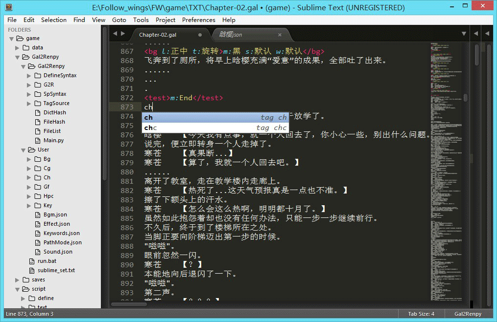
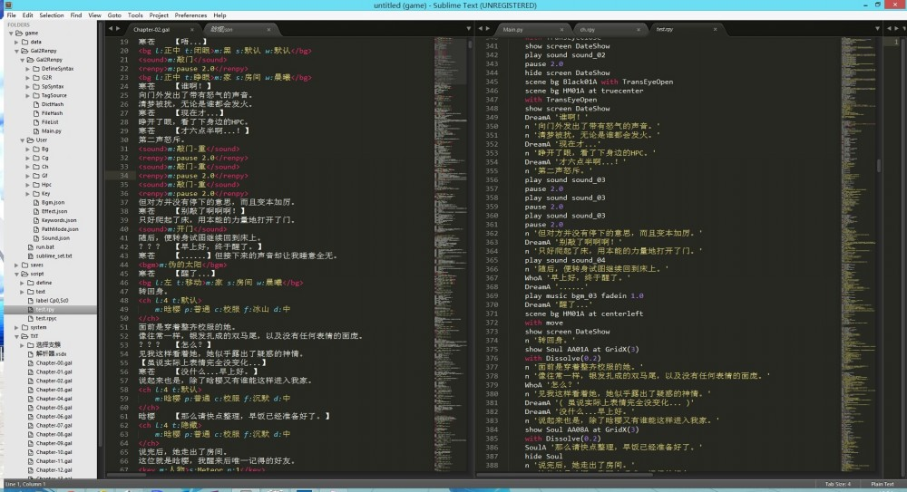
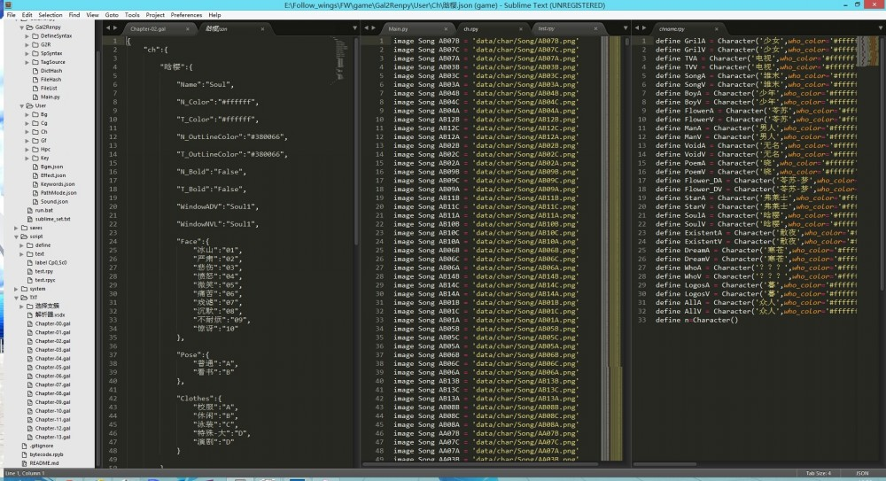

Gal2Renpy
=========

说明文档(Documentation):  
<https://github.com/dtysky/Gal2Renpy/wiki>

Gal2Renpy是一个游戏剧本解析器，用于将自定义格式的游戏剧本转换为游戏引擎ren'py的脚本，目的是将剧本文件和脚本代码**完全分离**，让剧本写手能够安于剧本创作。  

Gal2Renpy拥有清晰的资源结构，并为剧本提供了一套类xml的语法，使其一目了然，同时为了克服xml输入的繁琐，开发了sublime的**辅助插件**，用于快速输入和语法高亮；不但如此，Gal2Renpy还提供简单灵活的**扩展方式**，高级用户可以按照自己的想法添加几乎是任何自己想要的功能；同时，Gal2Renpy提供了**错误提示**，能够明确而方便地指出资源和剧本中出现的纰漏。

插件
---

剧本转换前后
-----------

资源文件生成
----------

作者
---
戴天宇(dtysky)   
[dtysky@outlook.com](dtysky@outlook.com)  
[http://github.com/dtysky](http://github.com/dtysky)

版权
---
Copyright © 2014, 戴天宇(dtysky)。 拥有所有权利。  
此项目属于自由软件，遵守[MIT License (MIT)](http://mit-license.org/)开源软件协议。